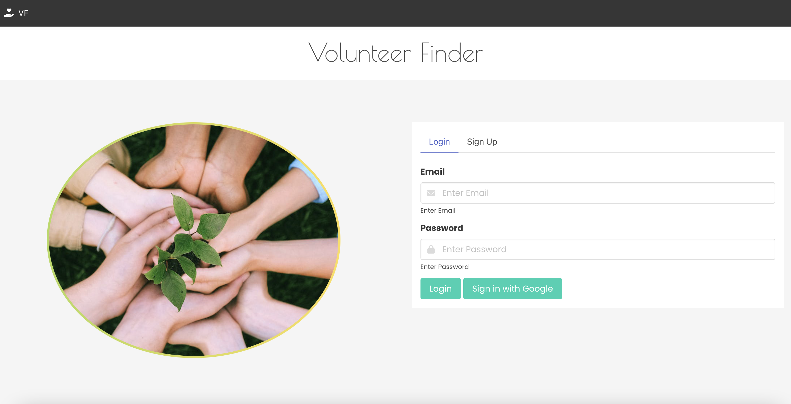

# Fullstack Developer Bootcamp - Project One

## Description

Web application that allows businesses to create accounts and search for and/or favorite volunteers to work with on initiatives.

## Table of Contents
  * [Technology Stack](#technology-stack)
  * [User Story](#user-story)
  * [Acceptance Criteria](#acceptance-criteria)
  * [Project Requirements](#project-requirements)
  * [The Team](#the-team)
  * [The Team Tasks](#the-team-tasks)
  * [Screenshot](#screenshot)
  * [Deployed page](#deployed-page)
  * [License](#license)
  * [Outside Resources](#outside-resources)

## Technology Stack


## User Story

```md
AS A business owner
I WANT to see available volunteers
SO THAT I can plan a volunteer project
```

## Acceptance Criteria

```md
GIVEN when I access the page I am presented with a login/sign-up form
GIVEN an account has been created
WHEN I sign-in/sign-up to the website
THEN I view the main page
WHEN I view the main page
THEN I am presented with a list of available volunteers (avatar, name, city/state)
WHEN I click a volunteer
THEN I am presented with their information (avatar, name, city/state, phone/email)  
a map with their location, a link to contact the volunteer, and a button to  
save to my preferred volunteers list
WHEN I visit the profile settings page
THEN I can update my name, email and/or business name
WHEN I update my data
THEN I am presented with a modal confirming my changes
WHEN I view the volunteer list on the profile settings page
THEN I can click the volunteer name to view more details, or  
click the trash icon to remove from my list
WHEN I click the sign out button
THEN I am redirected to the login page
```

## Project Requirements

```md
Use a CSS framework other than Bootstrap.
Be deployed to GitHub Pages.
Be interactive (in other words, accept and respond to user input).
Use at least two server-side APIs (Links to an external site).
Use modals instead of alerts, confirms, or prompts.
Use client-side storage to store persistent data.
Be responsive.
Have a polished UI.
Have a clean repository that meets quality coding standards (file structure,  
naming conventions, best practices for class/id naming conventions,  
indentation, quality comments, and so on).
Have a quality README (including a unique name, description, technologies  
used, screenshot, and link to the deployed application).
```

## The Team
 
[Kevin Rhode](https://github.com/KevinRhode)  
[Joshua Cavell](https://github.com/xclusive36)  
[Dylan Wednieski](https://github.com/iam3dski)  
[Erin Keller](https://github.com/erin-m-keller)

## The Team Tasks

**Kevin Rhode**: [tasks go here]  
**Joshua Cavell**: [tasks go here]  
**Dylan Wednieski**: [tasks go here]  
**Erin Keller**: [tasks go here]

## Screenshot



## Deployed page

[View Published Page](https://erin-m-keller.github.io/project-one/)

## License

[MIT](https://choosealicense.com/licenses/mit/)

## Outside Resources

  * [Firebase](https://firebase.google.com/docs)
  * [Bulma](https://bulma.io/documentation/)    
  * [Random Data API](https://random-data-api.com/documentation)  
  * [Selecting Colors](https://coolors.co/)
  * [Mozilla Dev Docs](https://developer.mozilla.org/)  
  * [Javascript Dev Docs](https://www.tutorialrepublic.com/)  
  * [W3 Schools Modal Animation](https://www.w3schools.com/howto/howto_css_modals.asp)
  * [JS Infinite croll](https://www.javascripttutorial.net/javascript-dom/javascript-infinite-scroll/)  

